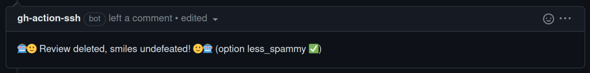
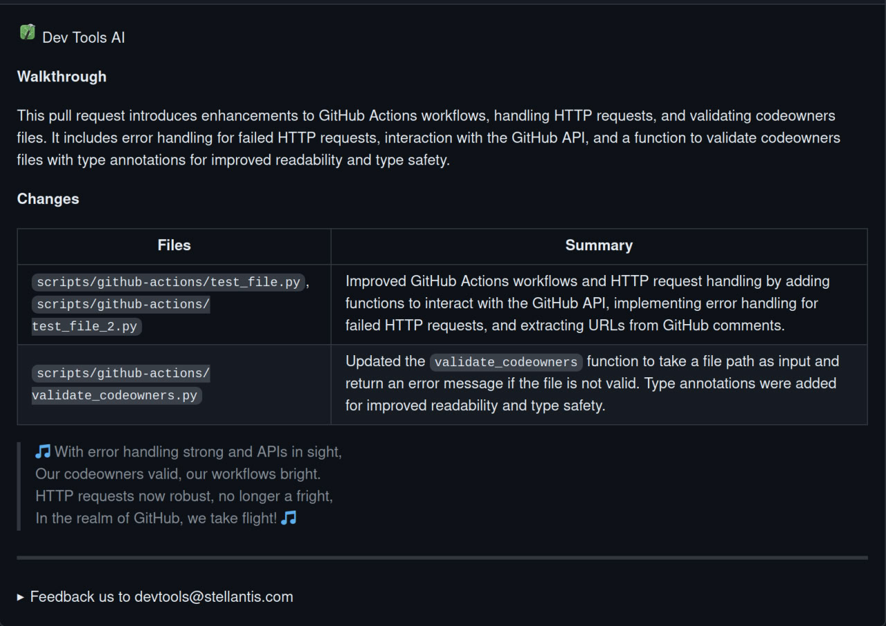
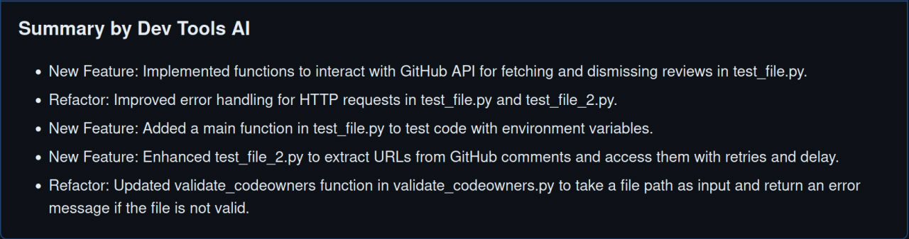
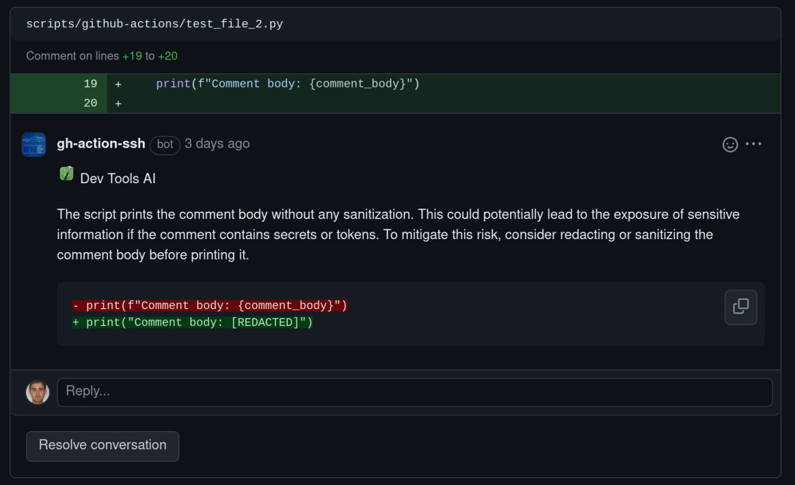
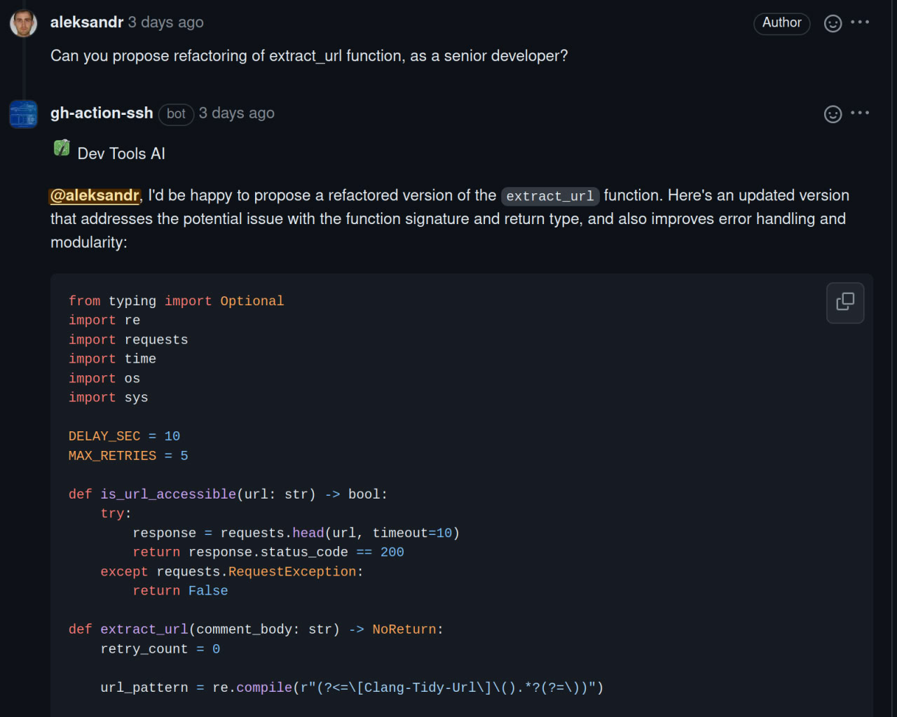

# DevToolsAi PR Reviewer

This project is inspired by CodeRabbit. 
However, the original CodeRabbit is no longer maintained, so it was forked, improved, and rewritten from scratch in Python. 
Another motivation was to use it within Stellantis and run it on internal deployed models, 
ensuring that no data is sent to OpenAI servers.


# AI-based PR reviewer and summarizer

[](https://opensource.org/licenses/MIT)
[](https://github.com/coderabbitai/ai-pr-reviewer/commits/main)

## Overview

DevTools `pr-reviewer-ai` is an AI-based code reviewer and summarizer for
GitHub pull requests using Mistral's `large` and `small` models, deployed on a custom cluster
or in Azure.It is designed to be used as a GitHub Action and can be configured to run on every
pull request and review comments.

## Reviewer Features:

- **PR Summarization**: It generates a summary and release notes of the changes
  in the pull request.
- **Line-by-line code change suggestions**: Reviews the changes line by line and
  provides code change suggestions.
- **Continuous, incremental reviews**: Reviews are performed on each commit
  within a pull request, rather than a one-time review on the entire pull
  request.
- **Cost-effective and reduced noise**: Incremental reviews save on OpenAI costs
  and reduce noise by tracking changed files between commits and the base of the
  pull request.
- **"Light" model for summary**: Designed to be used with a "light"
  summarization model (e.g. `mistral-small`) and a "heavy" review model (e.g.
  `mistral-large`). _For best results, use `mistral-large` as the "heavy" model, as thorough
  code review needs strong reasoning abilities._
- **Chat with bot**: Supports conversation with the bot in the context of lines
  of code or entire files, useful for providing context, generating test cases,
  and reducing code complexity.
- **Smart review skipping**: By default, skips in-depth review for simple
  changes (e.g. typo fixes) and when changes look good for the most part. It can
  be disabled by setting `review_simple_changes` and `review_comment_lgtm` to
  `true`.
- **Customizable prompts**: Tailor the `system_message`, `summarize`, and
  `summarize_release_notes` prompts to focus on specific aspects of the review
  process or even change the review objective.

To use this tool, you need to add the provided YAML file to your repository and
configure the required environment variables, such as `GITHUB_TOKEN` (could be done automatically with
`create-github-app-token`).
For more information on usage, examples, contributing, and
FAQs, you can refer to the sections below.

- [Overview](#overview)
- [Professional Version of CodeRabbit](#professional-version-of-coderabbit)
- [Reviewer Features](#reviewer-features)
- [Install instructions](#install-instructions)
- [Conversation with CodeRabbit](#conversation-with-coderabbit)
- [Examples](#examples)
- [Contribute](#contribute)
- [FAQs](#faqs)


## Install instructions

`pr-reviewer-ai` runs as a GitHub Action. Add the below file to your repository
at `.github/workflows/pr-reviewer-ai.yml`

```yaml
name: Code Review

permissions:
  contents: read
  pull-requests: write

on:
  schedule:
    - cron: '0 1 * * *'  # Runs at 1 AM UTC every day
  workflow_dispatch:
  pull_request:
  pull_request_review_comment:
    types: [created]

concurrency:
  group:
    ${{ github.repository }}-${{ github.event.number || github.head_ref ||
    github.sha }}-${{ github.workflow }}-${{ github.event_name ==
    'pull_request_review_comment' && 'pr_comment' || 'pr' }}
  cancel-in-progress: ${{ github.event_name != 'pull_request_review_comment' }}

jobs:
  review:
    runs-on: ${{ vars.TAD_RUNNER }}
    timeout-minutes: 15
    steps:
      - name: "Create GitHub App Token"
        id: create-github-app-token
        uses: actions/create-github-app-token@v1.9.3
        with:
          app-id: ${{ vars.GH_ACTION_SSH_APP_ID }}
          private-key: ${{ secrets.GH_ACTION_SSH_APP_PRIVATE_KEY }}
          owner: ${{ github.repository_owner }}

      - name: "Action Setup Python"
        uses: actions/setup-python@v4
        with:
          python-version: '3.11'

      - name: "AI PR Reviewer"
        uses: opensource/ai-pr-reviewer@DEVX-new-branch
        env:
          GITHUB_TOKEN: ${{ steps.create-github-app-token.outputs.token }}
        with:
          light_model_token_azure: 'token'
          heavy_model_token_azure: 'token'
          allow_empty_review: 'false'
          less_spammy: 'false'
          debug: 'false'
          review_simple_changes: 'false'
          review_comment_lgtm: 'false'

```

#### Environment variables

- `GITHUB_TOKEN`: This should already be available to the GitHub Action
  environment. This is used to add comments to the pull request.

### Models: `mistral-small` and `mistral-large`

Recommend using `mistral-small` for lighter tasks such as summarizing the
changes (`mistral_light_model` in configuration) and `mistral-large` for more complex
review and commenting tasks (`mistral_heavy_model` in configuration).

Costs: as all our models runs internally, there is no cost associated with the usage of the models.

### Prompts & Configuration

See: [action.yml](./action.yml)

Tip: You can change the bot personality by configuring the `system_message`
value. For example, to review docs/blog posts, you can use the following prompt:

Tip: Once the Github action is deployed, you need to trigger `workflow_dispatch` to run the cache generation.
It will speed up the action at least twice.


<details>
<summary>Blog Reviewer Prompt</summary>

```yaml
system_message: |
  You are `@devtoolsai` (aka `github-actions[bot]`), a language model. 
  Your purpose is to act as a highly experienced
  DevRel (developer relations) professional with focus on cloud-native
  infrastructure.

  Company context -
  CodeRabbit is an AI-powered Code reviewer.It boosts code quality and cuts manual effort. Offers context-aware, line-by-line feedback, highlights critical changes,
  enables bot interaction, and lets you commit suggestions directly from GitHub.

  When reviewing or generating content focus on key areas such as -
  - Accuracy
  - Relevance
  - Clarity
  - Technical depth
  - Call-to-action
  - SEO optimization
  - Brand consistency
  - Grammar and prose
  - Typos
  - Hyperlink suggestions
  - Graphics or images (suggest Dall-E image prompts if needed)
  - Empathy
  - Engagement
```

</details>

## Conversation with DevToolsAi

You can reply to a review comment made by this action and get a response based
on the diff context. Additionally, you can invite the bot to a conversation by
tagging it in the comment (`@devtoolsai`).

Example:

> @devtoolsai Please provide a refactoring of this file as a senior developer.

Note: A review comment is a comment made on a diff or a file in the pull
request.

### Ignoring PRs

Sometimes it is useful to ignore a PR. For example, if you are using this action
to review documentation, you can ignore PRs that only change the documentation.
To ignore a PR, add the following keyword in the PR description:

```text
@devtoolsai: ignore
```

### Less spammy option

To reduce the number of comments made by the bot, you can set the `less_spammy`.
It will keep only comments that involve a conversation with the user.
It will delete all unresolved comments before doing the next review.

```text
with:
    less_spammy: 'true'
```



## Examples

Some of the reviews done by pr-reviewer-ai









Any suggestions or pull requests for improving the prompts are highly
appreciated.

## Contribute

### Developing

> First, you'll need to have at least python 3.11. 
> Secondly, the basic understanding of poetry.

Install the dependencies

```bash
$ poetry install
```

### Disclaimer

- Your code (files, diff, PR title/description) won't be shared with OpenAI.
- For the Stellantis users, all the models are deployed internally, so no data is sent to OpenAI servers.
